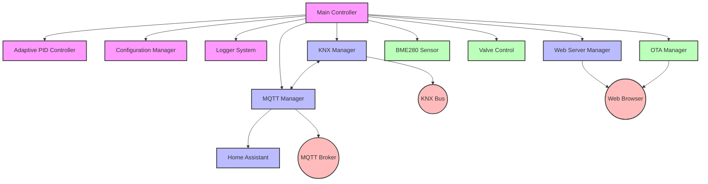
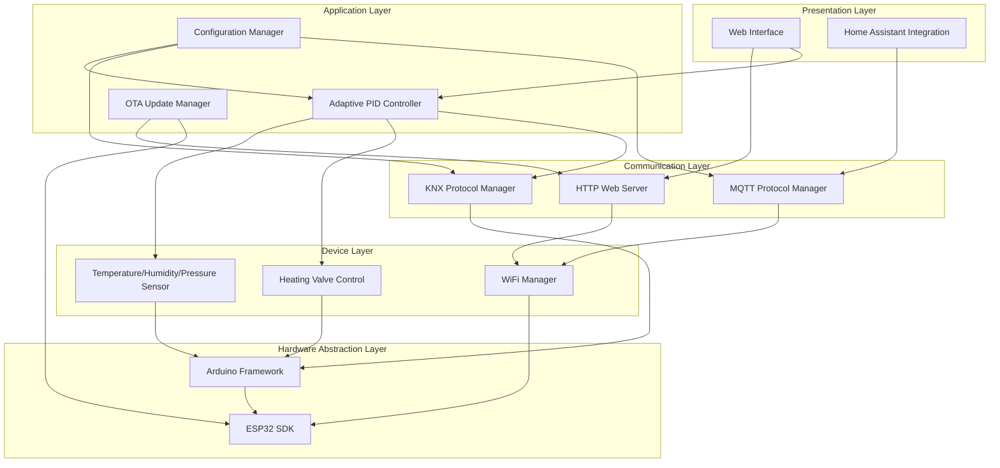
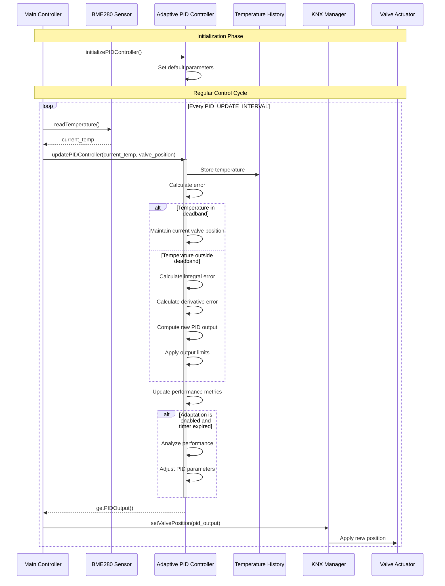

# ESP32-KNX-Thermostat

A modular smart thermostat system built on ESP32 that integrates with KNX building automation networks, providing advanced climate control with multiple connectivity options.


## Features

- **Advanced Climate Control**: Adaptive PID-based temperature regulation with self-tuning capability
- **Multi-Protocol Support**: 
  - Native KNX integration for building automation
  - MQTT connectivity for home automation systems
  - Web interface for direct control and configuration
- **Sensor Integration**: BME280 temperature/humidity/pressure monitoring
- **Robust Connectivity**: 
  - WiFi with advanced reconnection system
  - Fallback mechanisms and configuration portal
  - 45-minute watchdog timer for automatic recovery
- **Home Assistant Integration**: Full climate entity support with auto-discovery
- **OTA Updates**: Remote firmware upgrades via web interface
- **Persistent Configuration**: Settings stored in non-volatile memory
- **Flexible Operation Modes**: on or off...

## Architecture

### System Components
The thermostat uses a modular design with specialized components:



### Layered Architecture
The software is organized in a layered architecture for maintainability:



### PID Control Flow
The adaptive PID controller is central to temperature regulation:



## Hardware Requirements

- ESP32 development board (NodeMCU ESP32-S recommended)
- BME280 sensor module
- I²C connection cables
- Power supply (USB or 5V DC)

### Wiring Diagram

```
┌────────────┐           ┌────────────┐
│            │           │            │
│            │ SDA (21)  │            │
│   ESP32    ├───────────┤  BME280    │
│            │ SCL (22)  │            │
│            ├───────────┤            │
│            │ 3.3V      │            │
│            ├───────────┤            │
│            │ GND       │            │
└────────────┘           └────────────┘
```

## Getting Started

### Prerequisites

- PlatformIO IDE (recommended) or Arduino IDE
- Git client

### Installation

1. Clone this repository:
   ```
   git clone https://github.com/coolbox13/ESP32-KNX-Thermostat.git
   ```

2. Open the project in PlatformIO or configure Arduino IDE with required libraries:
   ```
   cd ESP32-KNX-Thermostat
   platformio project init
   ```

3. Review and update configuration settings:
   - Network settings (WiFi credentials)
   - KNX physical/group addresses 
   - MQTT broker details
   - Temperature control parameters

4. Build and upload:
   ```
   platformio run --target upload
   ```

5. Upload file system image for the web interface:
   ```
   platformio run --target uploadfs
   ```

### Initial Configuration

After uploading, the thermostat creates a WiFi access point named "ESP32-Thermostat-AP" if it can't connect to a saved network. Connect to this network to configure:

1. WiFi credentials
2. KNX physical/group addresses (can be toggled between test/production)
3. MQTT server details
4. Temperature control parameters

## Web Interface

The thermostat provides a responsive web interface for:
- Monitoring current temperature, humidity, pressure, and valve position
- Adjusting temperature setpoint
- Configuring system settings
- Updating firmware


## KNX Integration

The thermostat uses standard KNX datapoints:
- Temperature: DPT 9.001 (2-byte float)
- Setpoint: DPT 9.001 (2-byte float)
- Valve Position: DPT 5.001 (1-byte percentage)
- Operating Mode: DPT 20.102 (1-byte HVAC mode)

### KNX Addressing

Both test and production addresses are supported:
- Temperature Sensor: 0/0/4
- Humidity Sensor: 0/0/5
- Pressure Sensor: 0/0/6
- Valve Control: 1/1/1 (production) or 10/2/2 (test)

## Home Assistant Integration

The device automatically registers with Home Assistant via MQTT discovery:
- Creates a climate entity for temperature control
- Provides sensors for temperature, humidity, pressure, and valve position
- Supports on/off and heating modes
- Allows temperature setpoint adjustment

Example Home Assistant configuration:
```yaml
# Configuration is automatic via MQTT discovery
# No manual YAML configuration required!
```

## Project Structure

```
ESP32-KNX-Thermostat/
├── data/                        # Web interface files
│   ├── index.html               # Main dashboard
│   ├── style.css                # Styling 
│   └── script.js                # Dashboard functionality
├── include/                     # Header files
│   ├── adaptive_pid_controller.h # PID controller interface
│   ├── bme280_sensor.h          # Temperature sensor interface
│   ├── config.h                 # Configuration settings
│   ├── config_manager.h         # Configuration manager
│   ├── home_assistant.h         # HA integration
│   ├── knx_manager.h            # KNX protocol manager
│   ├── logger.h                 # Logging system
│   ├── mqtt_manager.h           # MQTT protocol manager
│   ├── ota_manager.h            # OTA update manager
│   ├── utils.h                  # Utility functions
│   └── valve_control.h          # Valve control interface
├── src/                         # Implementation files
│   ├── adaptive_pid_controller.cpp
│   ├── bme280_sensor.cpp
│   ├── config_manager.cpp
│   ├── home_assistant.cpp
│   ├── knx_manager.cpp
│   ├── logger.cpp
│   ├── main.cpp                 # Main application
│   ├── mqtt_manager.cpp
│   ├── ota_manager.cpp
│   ├── utils.cpp
│   ├── valve_control.cpp
│   └── web_server.cpp
└── platformio.ini               # PlatformIO configuration
```

## Development

### Adding New Sensors

The project follows an interface-based architecture that facilitates extension. To add a new sensor:

1. Create a new class implementing the sensor interface
2. Add the necessary initialization in `main.cpp`
3. Add data processing for the sensor readings
4. Update the web interface to display the new data

### Extending the Web Interface

The web interface uses standard HTML, CSS and JavaScript:

1. Edit the files in the `data` directory
2. Add new API endpoints in `web_server.cpp`
3. Upload the file system image to update the interface

## Troubleshooting

### WiFi Connection Issues

The system includes several recovery mechanisms:
- Automatic reconnection attempts
- Configuration portal when connection fails
- Watchdog timer for automatic reboot

Check the serial console for diagnostic messages:
```
[WIFI] WiFi connection lost. Attempting to reconnect...
[WIFI] Reconnection attempt 1 of 10 failed
...
[WIFI] Multiple reconnection attempts failed. Starting config portal...
```

### KNX Communication

The system logs all KNX messages:
```
[KNX] Sending temperature to KNX: 21.50°C
[KNX] Sending humidity to KNX: 45.20%
[KNX] Sending pressure to KNX: 1013.40 hPa
```

## Contributing

Contributions are welcome! Please follow the existing architecture and coding style when submitting pull requests.

## License

This project is released under the MIT License. See the LICENSE file for details.