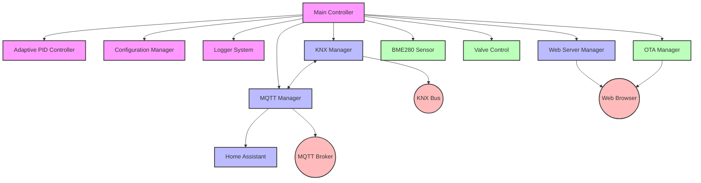
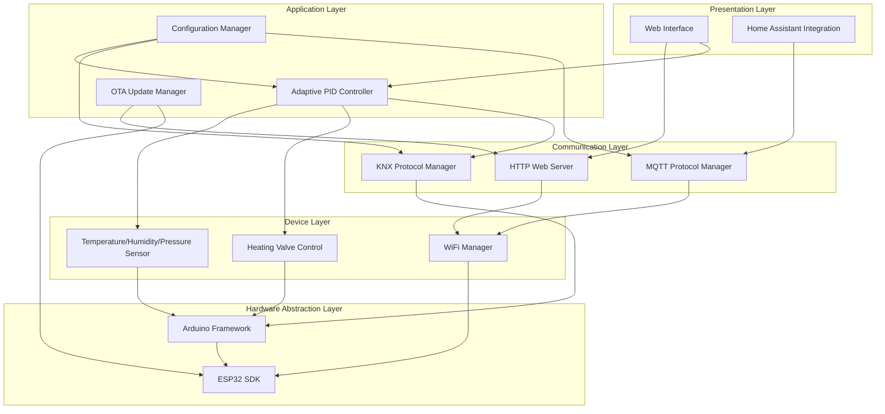
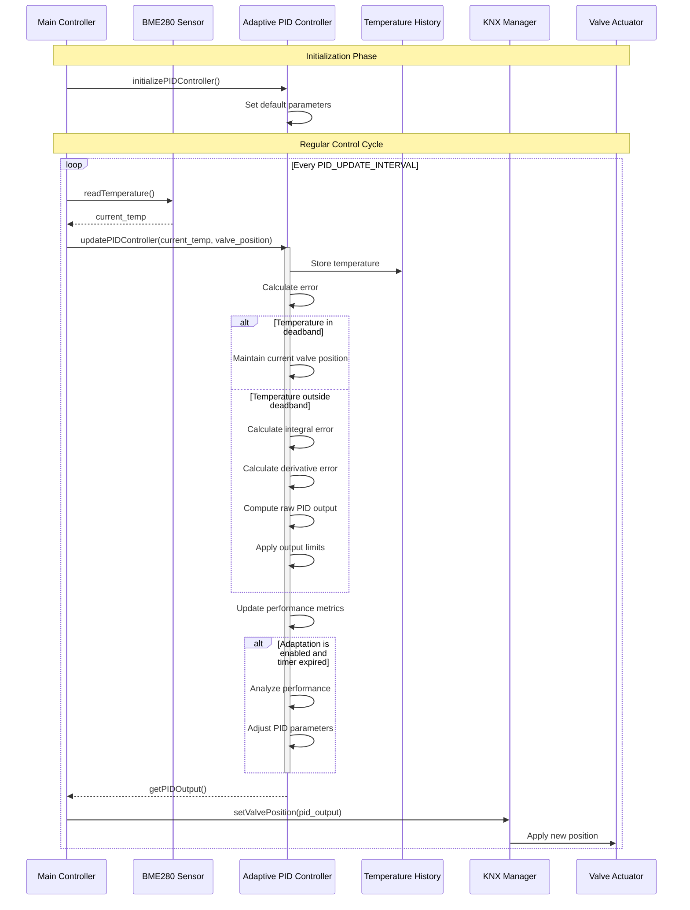

# ESP32-KNX-Thermostat

[](https://github.com/coolbox13/Minimal-Thermostat/actions/workflows/ci.yml)
[](https://platformio.org/)
[](https://opensource.org/licenses/MIT)
[](https://github.com/coolbox13/Minimal-Thermostat/commits/main)

A modular smart thermostat system built on ESP32 that integrates with KNX building automation networks, providing advanced climate control with multiple connectivity options.


## Features

- **Advanced Climate Control**:
  - Adaptive PID-based temperature regulation with self-tuning capability
  - Manual override functionality with timeout support
  - Sensor validation to prevent invalid readings from affecting control
  - Write coalescing for flash wear reduction (PID parameters saved max once per 5 minutes)
  - Configurable PID deadband and adaptation intervals

- **Component Health Monitoring**:
  - **Sensor Health Monitoring**: Tracks consecutive failures, calculates failure rates, automatic recovery detection
  - **Valve Health Monitoring**: Validates commanded vs. actual position, detects stuck valves, error history tracking
  - Real-time health status visible in web UI with color-coded indicators
  - Alert thresholds: 3 failures = warning, 10+ failures = critical

- **Multi-Protocol Support**:
  - Native KNX integration for building automation
  - MQTT connectivity for home automation systems
  - Web interface for direct control and configuration
  - Webhook integration for IFTTT, Zapier, and custom automation

- **Sensor Integration**:
  - BME280 temperature/humidity/pressure monitoring
  - 24-hour historical data storage (circular buffer, 5-minute intervals, 288 data points)
  - Real-time sensor readings with configurable update intervals
  - NTP time synchronization for accurate timestamps

- **Time Synchronization**:
  - NTP-based time synchronization with configurable server
  - Timezone and daylight saving time support
  - Real timestamps instead of uptime-based timing
  - Configurable via web interface

- **Robust Connectivity**:
  - Advanced WiFi connection manager with event-driven architecture
  - Automatic reconnection with configurable attempts (default: 10)
  - Internet connectivity testing (ping-based)
  - WiFi signal strength monitoring and reporting
  - Configuration portal when connection fails
  - Dual watchdog system (both configurable):
    - System watchdog for automatic recovery (default: 45 minutes)
    - WiFi watchdog for connection monitoring (default: 30 minutes)

- **Home Assistant Integration**:
  - Full climate entity support with auto-discovery via MQTT
  - Automatic device registration with 10 entities
  - Supports on/off and heating modes
  - Temperature setpoint adjustment
  - PID parameter sensors (Kp, Ki, Kd)
  - Diagnostic sensors (WiFi signal, uptime)
  - Valve position and heating status sensors

- **Web Interface (PWA)**:
  - Progressive Web App with offline support
  - Multiple pages: Dashboard, Status, Configuration, Event Logs
  - Real-time data visualization
  - Historical data graphing (24-hour view)
  - Mobile-responsive design with app icons
  - Component health indicators with live status updates

- **Event Logging & Monitoring**:
  - Persistent event log storage in SPIFFS (100 entries)
  - MQTT log publishing for remote monitoring
  - Filterable logs by level and tag
  - Web-based log viewer with export functionality
  - Log clearing via web interface

- **OTA Updates**:
  - Remote firmware upgrades via web interface
  - Safe update process with rollback capability

- **Configuration Management**:
  - Settings stored in non-volatile memory (Preferences API)
  - Configuration manager with web interface
  - **Configuration export/import** (download/upload JSON)
  - **Factory reset** functionality
  - Remote reboot capability
  - All PID parameters persistence
  - WiFi credentials storage
  - Timing intervals configurable via web UI

## Architecture

### System Components
The thermostat uses a modular design with specialized components:



### Layered Architecture
The software is organized in a layered architecture for maintainability:



### PID Control Flow
The adaptive PID controller is central to temperature regulation:



## Hardware Requirements

- ESP32 development board (NodeMCU ESP32-S recommended)
- BME280 sensor module
- I²C connection cables
- Power supply (USB or 5V DC)

### Wiring Diagram

```
┌────────────┐           ┌────────────┐
│            │           │            │
│            │ SDA (21)  │            │
│   ESP32    ├───────────┤  BME280    │
│            │ SCL (22)  │            │
│            ├───────────┤            │
│            │ 3.3V      │            │
│            ├───────────┤            │
│            │ GND       │            │
└────────────┘           └────────────┘
```

## Getting Started

### Prerequisites

- PlatformIO IDE (recommended) or Arduino IDE
- Git client

### Installation

1. Clone this repository:
   ```
   git clone https://github.com/coolbox13/ESP32-KNX-Thermostat.git
   ```

2. Open the project in PlatformIO or configure Arduino IDE with required libraries:
   ```
   cd ESP32-KNX-Thermostat
   platformio project init
   ```

3. Review and update configuration settings:
   - Network settings (WiFi credentials)
   - KNX physical/group addresses 
   - MQTT broker details
   - Temperature control parameters

4. Build and upload:
   ```
   platformio run --target upload
   ```

5. Upload file system image for the web interface:
   ```
   platformio run --target uploadfs
   ```

### Initial Configuration

After uploading, the thermostat creates a WiFi access point named "ESP32-Thermostat-AP" if it can't connect to a saved network. Connect to this network to configure:

1. WiFi credentials
2. KNX physical/group addresses (can be toggled between test/production)
3. MQTT server details
4. Temperature control parameters

## Web Interface

The thermostat provides a comprehensive Progressive Web App (PWA) with multiple pages:

### Dashboard (`/`)
- Real-time monitoring of temperature, humidity, pressure, and valve position
- Temperature setpoint adjustment
- Manual valve override control
- PID parameter display and adjustment
- Historical data graph (24-hour view)

### Status Page (`/status`)
- System status overview
- WiFi connection information (RSSI, IP, signal quality)
- Memory and flash usage statistics
- **Component Health section** with sensor and valve health monitoring
- Real-time health indicators (green/yellow/red status)
- Chip information and diagnostics

### Configuration Page (`/config`)
- WiFi credentials configuration
- KNX physical and group addresses (test/production toggle)
- MQTT broker settings (server, port)
- PID parameters configuration (Kp, Ki, Kd, deadband, adaptation interval)
- **NTP time synchronization** (server, timezone, DST offset)
- **System timing intervals** (sensor update, PID update, connectivity check)
- **Watchdog timeouts** (system watchdog, WiFi watchdog)
- **Webhook configuration** (URL, enable/disable, temperature thresholds)
- **Manual override settings** (timeout duration)
- Configuration export/import
- Factory reset option

### Event Logs Page (`/logs`)
- View persistent event logs
- Filter by log level (INFO, WARNING, ERROR)
- Filter by tag/category
- Export logs functionality
- Real-time log updates

### Features
- **Progressive Web App**: Installable on mobile devices, works offline
- **Responsive Design**: Optimized for desktop, tablet, and mobile
- **Real-time Updates**: WebSocket-like updates for live data
- **Dark Theme**: Modern, easy-on-the-eyes interface


## KNX Integration

The thermostat uses standard KNX datapoints:
- Temperature: DPT 9.001 (2-byte float)
- Setpoint: DPT 9.001 (2-byte float)
- Valve Position: DPT 5.001 (1-byte percentage)
- Operating Mode: DPT 20.102 (1-byte HVAC mode)

### KNX Addressing

Both test and production addresses are supported with configurable valve feedback:
- **Temperature Sensor**: 0/0/4 (output)
- **Humidity Sensor**: 0/0/5 (output)
- **Pressure Sensor**: 0/0/6 (output)
- **Valve Control**: 1/1/1 (production) or 10/2/2 (test) - command output
- **Valve Status**: 1/1/2 (production) - feedback input for closed-loop control

The valve status address enables bidirectional communication, allowing the thermostat to:
- Read actual valve position from feedback
- Detect stuck valves (commanded vs. actual mismatch)
- Enable closed-loop valve position control

## Home Assistant Integration

The device automatically registers with Home Assistant via MQTT discovery, creating **10 entities**:

**Climate Entity:**
- Thermostat control with on/off and heating modes
- Temperature setpoint adjustment (15-30°C)
- Current temperature display
- Heating action status

**Sensor Entities:**
- Temperature sensor (°C)
- Humidity sensor (%)
- Pressure sensor (hPa)
- Valve position (%)
- PID Kp parameter
- PID Ki parameter
- PID Kd parameter
- WiFi signal strength (dBm)
- System uptime (seconds)

**Binary Sensor:**
- Heating status (ON/OFF)

All entities include:
- Device information and unique IDs
- Availability tracking (online/offline status)
- State classes for proper history tracking
- Appropriate icons and units

Example Home Assistant configuration:
```yaml
# Configuration is automatic via MQTT discovery
# No manual YAML configuration required!
# All 10 entities appear automatically after MQTT connection
```

## Project Structure

```
ESP32-KNX-Thermostat/
├── data/                        # Web interface files (SPIFFS)
│   ├── index.html               # Main dashboard
│   ├── status.html              # Status page
│   ├── config.html              # Configuration page
│   ├── logs.html                # Event logs viewer
│   ├── style.css                # Shared styling
│   ├── script.js                # Dashboard functionality
│   ├── status.js                # Status page scripts
│   ├── config.js                # Configuration page scripts
│   └── manifest.json            # PWA manifest
├── include/                     # Header files
│   ├── adaptive_pid_controller.h # PID controller interface
│   ├── bme280_sensor.h          # Temperature sensor interface
│   ├── config.h                 # Configuration constants
│   ├── config_manager.h         # Configuration manager
│   ├── event_log.h              # Persistent event logging
│   ├── history_manager.h        # Historical data storage
│   ├── home_assistant.h         # HA integration
│   ├── knx_manager.h            # KNX protocol manager
│   ├── logger.h                 # Logging system
│   ├── mqtt_manager.h           # MQTT protocol manager
│   ├── ntp_manager.h            # NTP time synchronization
│   ├── ota_manager.h            # OTA update manager
│   ├── persistence_manager.h    # Persistent storage abstraction
│   ├── sensor_health_monitor.h  # Sensor health monitoring
│   ├── utils.h                  # Utility functions
│   ├── valve_control.h          # Valve control interface
│   ├── valve_health_monitor.h   # Valve health monitoring
│   ├── watchdog_manager.h       # Watchdog system
│   ├── web_server.h             # Web server manager
│   ├── webhook_manager.h        # Webhook integration
│   ├── wifi_connection.h        # WiFi connection manager
│   └── wifi_connection_events.h # WiFi event system
├── src/                         # Implementation files
│   ├── adaptive_pid_controller.cpp
│   ├── bme280_sensor.cpp
│   ├── config_manager.cpp
│   ├── event_log.cpp
│   ├── history_manager.cpp
│   ├── home_assistant.cpp
│   ├── knx_manager.cpp
│   ├── logger.cpp
│   ├── main.cpp                 # Main application
│   ├── mqtt_manager.cpp
│   ├── ntp_manager.cpp
│   ├── ota_manager.cpp
│   ├── persistence_manager.cpp
│   ├── sensor_health_monitor.cpp
│   ├── utils.cpp
│   ├── valve_control.cpp
│   ├── valve_health_monitor.cpp
│   ├── watchdog_manager.cpp
│   ├── web_server.cpp
│   ├── webhook_manager.cpp
│   └── wifi_connection.cpp
├── test/                        # Unit tests
│   └── test_utils/
│       └── test_precision.cpp
├── docs/                        # Documentation
├── partitions_custom.csv        # Custom partition table
├── platformio.ini               # PlatformIO configuration
└── README.md                    # This file
```

## Development

### Adding New Sensors

The project follows an interface-based architecture that facilitates extension. To add a new sensor:

1. Create a new class implementing the sensor interface
2. Add the necessary initialization in `main.cpp`
3. Add data processing for the sensor readings
4. Update the web interface to display the new data

### Extending the Web Interface

The web interface uses standard HTML, CSS and JavaScript:

1. Edit the files in the `data` directory
2. Add new API endpoints in `web_server.cpp`
3. Upload the file system image to update the interface

## REST API Endpoints

The thermostat provides a comprehensive REST API for programmatic control:

### Sensor Data
- `GET /api/sensor-data` - Current temperature, humidity, pressure readings
- `GET /api/history` - 24-hour historical data (288 data points)

### System Status
- `GET /api/status` - Complete system status (memory, WiFi, sensors, PID)
- `GET /api/sensor-health` - Sensor health monitoring status
- `GET /api/valve-health` - Valve health monitoring status

### Control
- `POST /api/setpoint` - Set temperature setpoint (5-30°C)
- `POST /api/manual-override` - Enable/disable manual valve override
- `GET /api/manual-override` - Get manual override status

### Configuration
- `GET /api/config` - Get all configuration settings
- `POST /api/config` - Update configuration settings
- `GET /api/config/export` - Export configuration as JSON file
- `POST /api/config/import` - Import configuration from JSON file

### System Management
- `POST /api/reboot` - Trigger system restart
- `POST /api/factory-reset` - Reset all settings to defaults

### Event Logs
- `GET /api/logs` - Retrieve persistent event logs
- `POST /api/logs/clear` - Clear all event logs

### Webhooks
- `POST /api/webhook/test` - Test webhook connectivity

All API endpoints return JSON responses with appropriate HTTP status codes.

## Troubleshooting

### WiFi Connection Issues

The system includes several recovery mechanisms:
- **Automatic Reconnection**: Configurable reconnection attempts (default: 10) with configurable timeout
- **Configuration Portal**: Automatically starts when connection fails
- **Watchdog System** (both configurable via web interface):
  - System watchdog (default: 45 minutes) for automatic reboot on system hang
  - WiFi watchdog (default: 30 minutes) for connection monitoring
- **Internet Connectivity Testing**: Periodic ping tests to verify internet access (configurable interval)
- **Signal Strength Monitoring**: Tracks WiFi signal quality and publishes to MQTT/HA

Check the serial console for diagnostic messages:
```
[WIFI] WiFi connection lost. Attempting to reconnect...
[WIFI] Reconnection attempt 1 of 10 failed
...
[WIFI] Multiple reconnection attempts failed. Starting config portal...
```

### Event Logging

The system maintains a persistent event log stored in SPIFFS:
- Access logs via web interface at `/logs`
- View logs via MQTT topic `esp32_thermostat/logs`
- Logs are automatically filtered (only WARNING and ERROR stored by default)
- Maximum 100 log entries (circular buffer)

### Sensor Issues

- Invalid sensor readings (NaN, infinity, out of range) are automatically rejected
- PID control skips cycles with invalid readings to prevent system instability
- **Sensor Health Monitoring** tracks consecutive failures with automatic alerting:
  - 3 consecutive failures → Warning logged to EventLog
  - 10+ consecutive failures → Critical error logged
  - Failure rate >50% over 5 minutes → Sensor marked unhealthy
- Check event logs for sensor error messages
- View real-time sensor health status on Status page (`/status`)
- Access programmatic health data via `/api/sensor-health`

### Valve Health Monitoring

- **Valve Health Monitoring** validates commanded vs. actual valve position:
  - Compares commanded position with feedback from valve status address (1/1/2)
  - Tracks position error history (100 samples)
  - Warning threshold: >10% position deviation
  - Critical threshold: >20% position deviation (stuck valve)
  - 5+ consecutive critical errors → Valve marked as stuck/non-responsive
- Check event logs for valve error messages
- View real-time valve health status on Status page (`/status`)
- Access programmatic health data via `/api/valve-health`
- Ensure valve status address (1/1/2) is correctly configured for feedback

### Memory Management

The system logs memory usage at startup:
- RAM usage statistics
- Flash/OTA partition usage
- SPIFFS usage
- Warnings when usage exceeds 90% or 95%

### Historical Data

The system maintains a 24-hour rolling history of sensor readings:
- Stores temperature, humidity, pressure, and valve position
- One data point every 5 minutes (288 points total)
- Accessible via web interface dashboard graph
- API endpoint: `/api/history` (returns JSON)
- Circular buffer automatically overwrites oldest data

## Configuration Settings Table

|Setting|Change Method|Storage|
|---|---|---|
|WiFi credentials|Web interface, WiFiManager|Preferences (persistent)|
|KNX physical address|Web interface|Preferences (persistent)|
|KNX group addresses|Web interface (test/production toggle)|Preferences (persistent)|
|KNX valve status address|Compile-time (config.h)|Hardcoded|
|MQTT server & port|Web interface|Preferences (persistent)|
|PID parameters (Kp, Ki, Kd)|Web interface|Preferences (persistent)|
|PID deadband|Web interface|Preferences (persistent)|
|PID adaptation interval|Web interface|Preferences (persistent)|
|Temperature setpoint|Web, MQTT, KNX|Preferences (persistent)|
|Valve position|Web, MQTT, KNX|Runtime only|
|Manual override timeout|Web interface|Preferences (persistent)|
|**NTP server**|**Web interface**|**Preferences (persistent)**|
|**Timezone offset**|**Web interface**|**Preferences (persistent)**|
|**Daylight saving offset**|**Web interface**|**Preferences (persistent)**|
|**Sensor update interval**|**Web interface**|**Preferences (persistent)**|
|**PID update interval**|**Web interface**|**Preferences (persistent)**|
|**Connectivity check interval**|**Web interface**|**Preferences (persistent)**|
|**System watchdog timeout**|**Web interface**|**Preferences (persistent)**|
|**WiFi watchdog timeout**|**Web interface**|**Preferences (persistent)**|
|**WiFi reconnect attempts**|**Web interface**|**Preferences (persistent)**|
|**WiFi connection timeout**|**Web interface**|**Preferences (persistent)**|
|**Webhook URL**|**Web interface**|**Preferences (persistent)**|
|**Webhook temperature thresholds**|**Web interface**|**Preferences (persistent)**|
|BME280 I²C address|Hardcoded (0x76)|Compile-time|
|I²C pins (SDA/SCL)|Hardcoded (21/22)|Compile-time|
|Debug level|Hardcoded|Compile-time|
|MQTT base topics|Hardcoded|Compile-time|

**Note**: Settings marked in **bold** are fully configurable via web interface and were previously incorrectly documented as hardcoded.

## Bus Communication Table

### MQTT Bus

|Direction|Topic|Purpose|
|---|---|---|
|Input|esp32_thermostat/mode/set|Set thermostat mode (heat/off)|
|Input|esp32_thermostat/temperature/set|Set temperature setpoint|
|Input|esp32_thermostat/valve/set|Set valve position directly|
|Input|esp32_thermostat/restart|Trigger device restart|
|Output|esp32_thermostat/status|Device online status (availability)|
|Output|esp32_thermostat/temperature|Current temperature|
|Output|esp32_thermostat/humidity|Current humidity|
|Output|esp32_thermostat/pressure|Current pressure|
|Output|esp32_thermostat/valve/position|Current valve position|
|Output|esp32_thermostat/mode/state|Current thermostat mode|
|Output|esp32_thermostat/temperature/setpoint|Current temperature setpoint|
|Output|esp32_thermostat/action|Current action (heating/idle)|
|Output|**esp32_thermostat/pid/kp**|**PID Kp parameter**|
|Output|**esp32_thermostat/pid/ki**|**PID Ki parameter**|
|Output|**esp32_thermostat/pid/kd**|**PID Kd parameter**|
|Output|**esp32_thermostat/wifi/rssi**|**WiFi signal strength (dBm)**|
|Output|**esp32_thermostat/uptime**|**System uptime (seconds)**|
|Output|**esp32_thermostat/heating/state**|**Heating status (ON/OFF)**|
|Output|esp32_thermostat/logs|Event log entries (JSON format)|

**Note**: Topics in **bold** were added for Home Assistant integration and diagnostic monitoring.

### KNX Bus

|Direction|Group Address|Purpose|DPT|
|---|---|---|---|
|Input|10/2/2 (test)|Valve control command input|5.001|
|Input|1/1/1 (production)|Valve control command input|5.001|
|**Input**|**1/1/2 (production)**|**Valve status feedback input**|**5.001**|
|Output|0/0/4|Temperature sensor value|9.001|
|Output|0/0/5|Humidity sensor value|9.007|
|Output|0/0/6|Pressure sensor value|9.006|
|Output|10/2/2 (test)|Valve position command output|5.001|
|Output|1/1/1 (production)|Valve position command output|5.001|

**Note**: The valve status address (1/1/2) enables bidirectional communication for closed-loop valve control and health monitoring.

## Recommendations for Future Development

1. **Remaining Hardcoded Settings**: Add configuration options in the web interface for:
    - I²C address and pins for BME280
    - MQTT base topic structure
    - KNX valve status address (currently compile-time only)

2. **Communication Protocol Enhancements**:
    - Add proper KNX datapoint types for thermostat mode (DPT 20.102)
    - Enable temperature setpoint control via KNX (currently only MQTT/Web)

3. **Security Improvements**:
    - Add MQTT username/password to web configuration
    - Implement secure storage for credentials
    - Add authentication for the web interface
    - Consider TLS for MQTT connections

4. **User Experience**:
    - Implement profiles for different operating modes (comfort, eco, away)
    - Enhance mobile responsiveness of configuration page
    - Add scheduling/automation support

5. **Advanced Features**:
    - Add energy-saving mode with reduced PID update frequency
    - Consider battery backup option for critical settings
    - Implement valve position learning/calibration
    - Add frost protection mode

## Home Assistant Integration Table

|Direction|Entity Type|Entity ID|Purpose|Data Type|State Class|
|---|---|---|---|---|---|
|Input/Output|climate|esp32_thermostat_thermostat|Thermostat control|temperature, setpoint, mode, action|N/A|
|Output|sensor|esp32_thermostat_temperature|Current temperature|°C|measurement|
|Output|sensor|esp32_thermostat_humidity|Current humidity|%|measurement|
|Output|sensor|esp32_thermostat_pressure|Current pressure|hPa|measurement|
|Output|sensor|esp32_thermostat_valve_position|Valve position|%|measurement|
|Output|**sensor**|**esp32_thermostat_pid_kp**|**PID Kp parameter**|**numeric**|**N/A**|
|Output|**sensor**|**esp32_thermostat_pid_ki**|**PID Ki parameter**|**numeric**|**N/A**|
|Output|**sensor**|**esp32_thermostat_pid_kd**|**PID Kd parameter**|**numeric**|**N/A**|
|Output|**sensor**|**esp32_thermostat_wifi_signal**|**WiFi signal strength**|**dBm**|**measurement**|
|Output|**sensor**|**esp32_thermostat_uptime**|**System uptime**|**seconds**|**total_increasing**|
|Output|**binary_sensor**|**esp32_thermostat_heating**|**Heating status**|**ON/OFF**|**N/A**|

**Total Entities**: 11 (1 climate, 9 sensors, 1 binary sensor)

All entities include:
- Availability topic for online/offline tracking
- Device information and unique identifiers
- Appropriate icons and device classes

## Recommendations for Home Assistant Integration

1. **Additional Entities** (not yet implemented):
    - **Energy sensor**: Add power consumption tracking for energy dashboards
    - **Thermostat mode sensor**: More detailed operating modes (comfort, away, night)
    - **Component health sensors**: Expose sensor/valve health status from health monitors

2. **Enhanced Integration**:
    - Create a dashboard template that can be easily imported
    - Add energy management entities for consumption tracking
    - Add service calls for advanced functions like PID parameter tuning from HA

3. **Advanced Automation Features**:
    - Weekly schedule programming via Home Assistant automations
    - Presence detection integration for smarter heating
    - Enable multiple temperature presets (comfort, eco, away)
    - Implement temperature offset calibration capability

**Already Implemented** ✅:
- WiFi signal strength sensor
- Uptime sensor
- PID parameter sensors (Kp, Ki, Kd)
- Device class and state class attributes
- Proper unit of measurement
- Availability tracking

## Contributing

No intention of developing further for other use besides my own home. Please fork and go ahead.

Special thanks to Nico Weichbrodt <envy> for building an ESP library for KNX communiocation. I used it to port to ESP32 and make this thermostat possible.

esp-knx-ip library for KNX/IP communication on an ESP32
 * Ported from ESP8266 version
 * Author: Nico Weichbrodt <envy> (Original), Modified for ESP32
 * License: MIT

## License

This project is released under the MIT License.